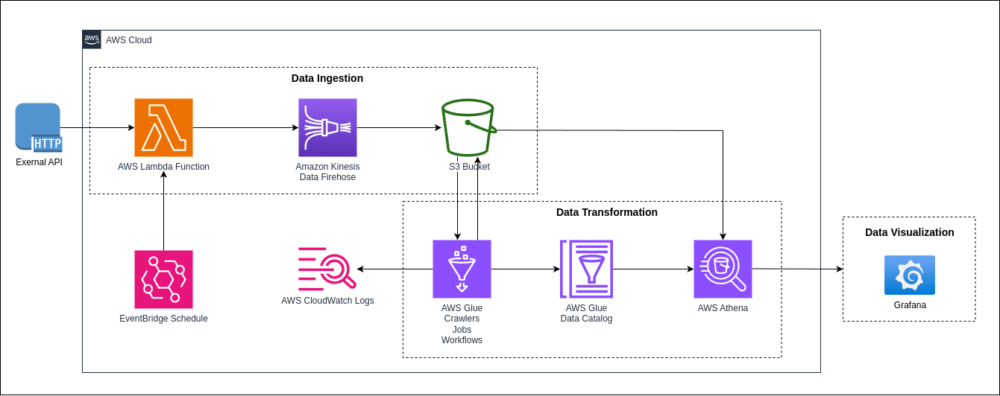
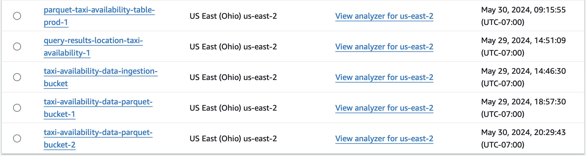
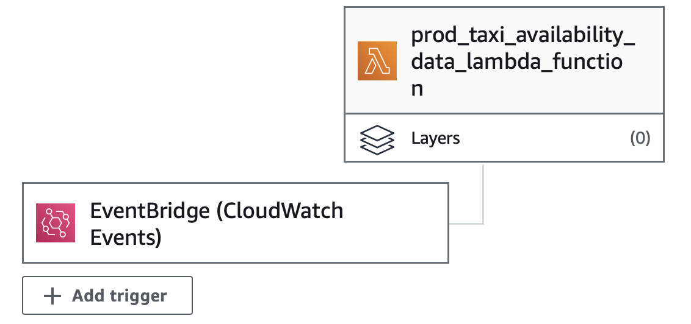
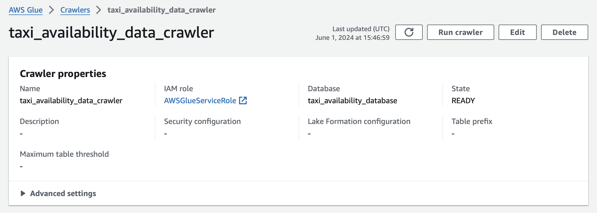
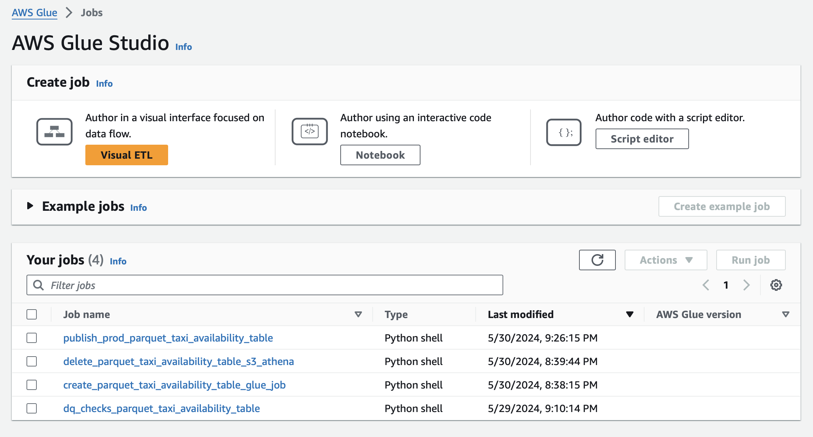
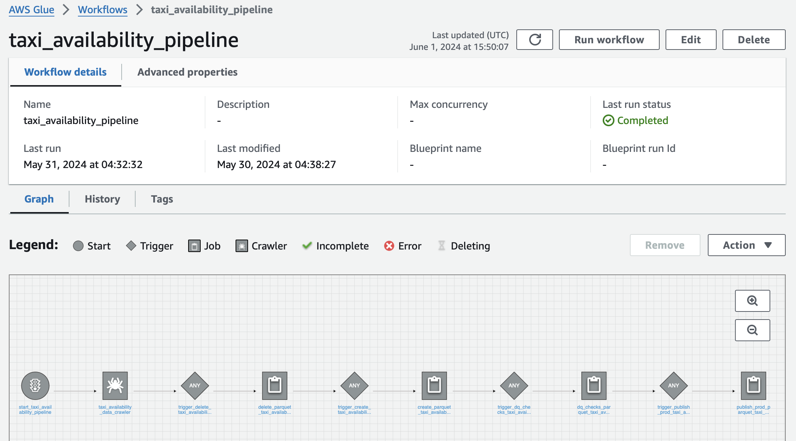
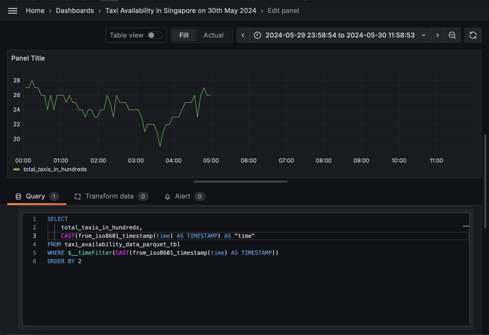

# Serverless-ETL-Application-on-AWS
Building a serverless ETL application on AWS (as part of Maven Course)

Let's start with understanding what serverless and ETL pipeline is. Serverless means there is no centralized machine to manage the tasks assigned to worker nodes. ETL pipeline is a set of worker nodes, each of them performing 1 task of either of the 3 majors functions - Extract (data ingestion), Transform (data orchestration), Load (data visualization).

Serverless ETL Pipelines are workflows where worker nodes performing tasks communicate with one another (without the need for a server) to get the ETL Job completed.

Below is the Architecture followed in building a Serverless ETL Application in AWS. All ETL pipelines will have the 3 parts as in the diagram.

Image credits: David Freitag

PART 1: Data Ingestion
This is the part where data is extracted from external sources and ingested into AWS.
1. Storing data in AWS S3 and use AWS Athena to query it.
Data in AWS is stored in S3 buckets and Athena query editor is used to explore all the data within S3.

S3 buckets are created to store data and accessed as and when needed by AWS services throughout the ETL pipeline.

Athena is the serverless query editor of AWS used to work with data and analyse the data within the tables.

2. Use Lambda functions to ingest data to S3.
AWS Lambda function (python script) ingests data extracted from source into S3.

Lambda functions are serverless mode of running python code. Python scripts can be run in AWS through Lambda without the need for a virtual machine (compute power).

Lambda functions are created in AWS to run data ingestion scripts that will pull data from external sources and push into S3. We can use Athena to check the data is correctly stored in the tables in the way we need.

3. Automate execution of Lambda functions with EventBridge triggers
Use Trigger on lambda functions to automatically ingest data into S3.

Triggers are the way we can invoke/schedule lambda functions without the need for manual intervention.

EventBridge is the AWS trigger service used on lambda functions to execute them repeatedly. EventBridge triggers are created and attached to the lambda function we want to invoke. We can enable and disable triggers based on our need.

PART 2: Data Transformation (major part in an ETL pipeline)
1. Batching the ingested data using AWS Firehose (previously known as Kinesis Firehose)
The ingested data can be batched which will be later be highly helpful while analysing a particular portion of the data we ingested.

AWS Firehose is the serverless batching data service that batches the data captured from the source and stores it in S3. Firehose is highly scalable in a way it can actually handle as high volumes as we want.

A Firehose instance is created and configured based on how we want our data to be batched. Now, attaching it to a lambda function which extracts data from a source will ingest data into Firehose which in turn places data in batches into S3.

2. Build table from the batched data using Glue Crawler
Crawl all batched data by AWS Firehose to automatically build a table where the table will contain data from all the batches. Crawler is part of a larger service called AWS Glue.

4. Create jobs in AWS Glue used in AWS Glue workflow to prepare the production data used for visualization
Parquet is a column store data format. Unlike row store data format which groups data in a row as a single object, parquet format groups data in a column as a single object. Storing the column grouped data is good as compression algorithms operate on homogenous data and when querying this data will be cheaper. Parquet files can be partitioned similar to data created by AWS Firehose, partitioned tables allows the query to pull the data happened to be partition can result in reducing query cost and increasing query speed.

Glue jobs (lambda functions) (worker nodes) performs a single unit of work. Each job does a portion for work required to transform the raw data into desired dataset. Each job runs a transformation in SQL which is passed to AWS Athena comes back with query results making it available to be pushed into S3 in desired format required for the next job.

Important: AWS Glue job runs in form of DPU (Data Processing Unit) which is a VM with compute and memory. We will be charged in terms of DPUs used for every Glue job we run.

4. Build the Glue workflow to put together all the jobs created in previous step to get the production data ready
Glue workflow is orchestrating Glue jobs executed in a sequence to transform raw data into prod data.

General workflow will contain 4 Glue jobs.
    1. Invoke the Glue crawler to crawl the data ingested by AWS Firehose and create the table for the next step of workflow
    2. Trigger the Delete Glue job (Glue Job 1) to remove any old parquet table in S3 bucket
    3. Trigger the Create Glue job (Glue Job 2) to create fresh parquet format partitioned table and place it in S3
    4. Trigger the Data Quality Check Glue job (Glue Job 3) to check the quality of data in the parquet table created by the Create Glue job.
    5. Trigger the Prod Glue job (Glue Job 4) to store a final desirable version of the parquet table used for visualization.

PART 3: Data Visualization
Grafana is a open-source visualization tool which can be easily integrated with AWS. By configuration and connecting Grafana and AWS Athena, we can visualize the data in the tables inside S3 buckets.

The use-case I achieved in this project is Checking the availability of taxis in Singapore during business hours 8:00 A.M. to 8:00 P.M. (Singapore local time)

External Source - Singapore Gov. Real-time API - Taxi Availability - https://beta.data.gov.sg/datasets/d_e25662f1a062dd046453926aa284ba64/view

Data Analysed - The taxis available (in hundreds) on May 30th, 2024 in Singapore between 8:00 A.M. and 8:00 P.M. 
